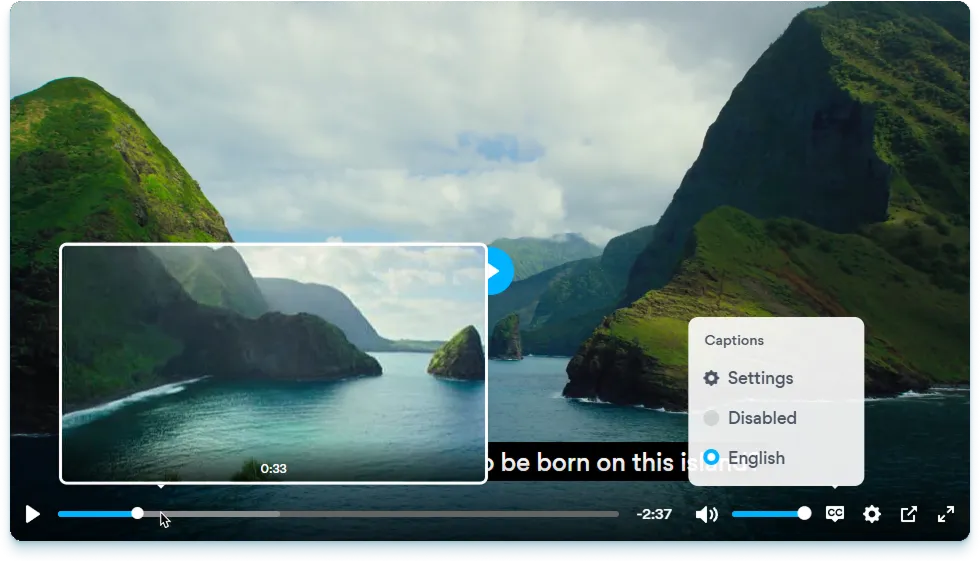

<div align="center">
    <picture>
        <source media="(prefers-color-scheme: dark)" srcset="logo-dark.svg" />
        <source media="(prefers-color-scheme: light)" srcset="logo-light.svg" />
        
    </picture>
    <br>
    <b>Una skin per <a href="https://videojs.com">Video.js</a> che lo fa sembrare <a href="https://plyr.io">Plyr</a>.</b>
</div>
<br><br>



<div align="center">
    <a href="README.md">English</a> | <b>Italiano</b>
    <h2><a href="https://videojs-plyr.zappr.stream">Prova la demo</a> - <a href="#installazione">Salta alle istruzioni sull'installazione</a></h2>
</div>

# Cosa?
Sì, è tutto vero. L'immagine che vedi qui sopra è _veramente_ come appare videojs-plyr appena installato, tranne per il font. È CSS al 100%, senza alcun JavaScript, ed è integrato con i plugin [videojs-contrib-quality-menu](https://github.com/videojs/videojs-contrib-quality-menu) e [videojs-sprite-thumbnails](https://github.com/phloxic/videojs-sprite-thumbnails).

# Perché?
Perché Plyr è un player **bellissimo**, ma non funziona molto bene dal punto di vista tecnico, soprattutto quando si tratta di stream. Video.js, d'altra parte, non ha un bell'aspetto con nessuno dei suoi temi predefiniti, ma funziona decisamente meglio dal punto di vista tecnico.

Lo so bene, essendo il maintainer di Zappr, una web app per guardare il digitale terrestre italiano. L'Italia, essendo un paese in cui la televisione lineare è la piattaforma di visione video preferita dal [70% degli utenti](https://www.screenvoice.cz/en/news/linear-tv-still-outperforms-streaming-and-ott-in-europe/), è sede di **TANTISSIMI** canali televisivi, nazionali e regionali, che ovviamente distribuiscono i loro contenuti in diretta e on-demand in modi molto diversi tra di loro.

Ne ho viste di tutti i colori. E anche se Plyr è un ottimo player in grado di coprire il 99% dei casi d'uso, Zappr aveva bisogno di uno che potesse supportarne il 100% senza rinunciare all'estetica. Quindi, visto che non c'era una soluzione migliore, ho creato videojs-plyr.

## Quindi, sì, probabilmente non fa per te...
A meno che non ti serva un player che supporti alla perfezione tutti i casi d'uso più assurdi che derivano dal fornire i contenuti in diretta e on-demand di oltre 1500 canali TV, questo progetto non fa per te. In altre parole, quasi sicuramente non fa per te.

Se ti piace l'aspetto di Plyr, [usalo e basta](https://github.com/sampotts/plyr). O meglio ancora, usa il suo successore, [Vidstack](https://vidstack.io): è tuttora mantenuto, [ha un tema Plyr integrato](https://vidstack.io/player/demo/?layout=plyr&framework=react&view=player&config=%7B%22player%22%3A%7B%22src%22%3A%22https%3A%2F%2Ffiles.vidstack.io%2Fsprite-fight%2F720p.mp4%22%2C%22viewType%22%3A%22video%22%2C%22streamType%22%3A%22on-demand%22%2C%22logLevel%22%3A%22warn%22%2C%22crossOrigin%22%3Atrue%2C%22playsInline%22%3Atrue%2C%22title%22%3A%22Sprite+Fight%22%2C%22poster%22%3A%22https%3A%2F%2Ffiles.vidstack.io%2Fsprite-fight%2Fposter.webp%22%2C%22textTracks%22%3A%5B%7B%22src%22%3A%22https%3A%2F%2Ffiles.vidstack.io%2Fsprite-fight%2Fsubs%2Fenglish.vtt%22%2C%22label%22%3A%22English%22%2C%22language%22%3A%22en-US%22%2C%22kind%22%3A%22subtitles%22%2C%22type%22%3A%22vtt%22%2C%22default%22%3Atrue%7D%2C%7B%22src%22%3A%22https%3A%2F%2Ffiles.vidstack.io%2Fsprite-fight%2Fsubs%2Fspanish.vtt%22%2C%22label%22%3A%22Spanish%22%2C%22language%22%3A%22es-ES%22%2C%22kind%22%3A%22subtitles%22%2C%22type%22%3A%22vtt%22%7D%2C%7B%22src%22%3A%22https%3A%2F%2Ffiles.vidstack.io%2Fsprite-fight%2Fchapters.vtt%22%2C%22language%22%3A%22en-US%22%2C%22kind%22%3A%22chapters%22%2C%22type%22%3A%22vtt%22%2C%22default%22%3Atrue%7D%5D%7D%2C%22layout%22%3A%7B%22type%22%3A%22plyr%22%2C%22thumbnails%22%3A%22https%3A%2F%2Ffiles.vidstack.io%2Fsprite-fight%2Fthumbnails.vtt%22%7D%2C%22hls%22%3A%7B%7D%2C%22dash%22%3A%7B%7D%2C%22events%22%3A%5B%22can-play%22%5D%7D), e tutto è modulare e personalizzabile.

# Installazione
Puoi installare videojs-plyr da NPM, con il tuo gestore di pacchetti preferito:
```sh
npm install videojs-plyr
```
```html
<link rel="stylesheet" href="node_modules/videojs-plyr/css/videojs-plyr.min.css">
```

In alternativa, lo puoi importare direttamente da un CDN come jsDelivr:
```html
<link rel="stylesheet" href="https://cdn.jsdelivr.net/npm/videojs-plyr/css/videojs-plyr.min.css">
```

Poi, per usarlo, basta aggiungere la class `vjs-theme-plyr` al tuo elemento Video.js:
```html
<video class="video-js vjs-theme-plyr"></video>
```

Finalmente, visto che di default l'interfaccia è in inglese, ci sono alcuni voci/titoli di menu che potresti voler tradurre. Per farlo, basta modificare i valori di queste variabili CSS:
```css
--videojs-plyr-quality-text: "Quality";
--videojs-plyr-captions-text: "Captions";
--videojs-plyr-audiotracks-text: "Audio track";
--videojs-plyr-disabled-text: "Disabled";
--videojs-plyr-settings-text: "Settings";
```

E questo è tutto!

## Varianti
La cartella `css` contiene 4 file CSS, ovvero le versioni normali e "legacy" della libreria, sia in formato non minificato che minificato. La versione legacy supporta molto meglio i browser più veccho, ma è un po' più pesante (perché viene realizzata da postcss-preset-env con una query Browserslist di `> 0%`).

- `videojs-plyr.css` - Versione normale non minificata
- `videojs-plyr.min.css` - Versione normale minificata
- `videojs-plyr.legacy.css` - Versione legacy non minificata
- `videojs-plyr.legacy.min.css` - Versione legacy minificata

# Licenza
videojs-plyr è concesso in licenza ai sensi della GNU General Public License v3.0. Quindi puoi farci quello che vuoi ma non puoi distribuirne versioni closed source.