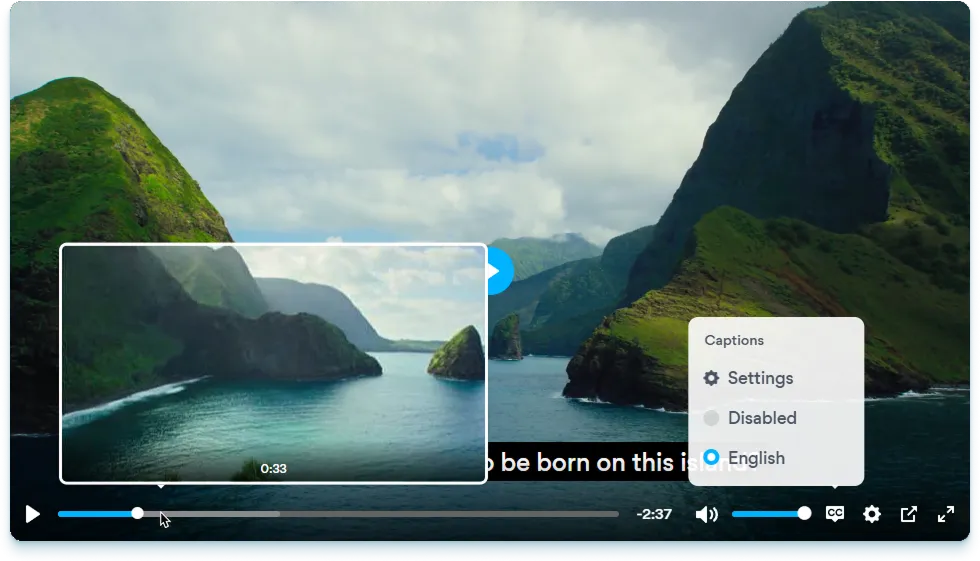

<div align="center">
    <picture>
        <source media="(prefers-color-scheme: dark)" srcset="logo-dark.svg" />
        <source media="(prefers-color-scheme: light)" srcset="logo-light.svg" />
        
    </picture>
    <br>
    <b>A skin for <a href="https://videojs.com">Video.js</a> that makes it look like <a href="https://plyr.io">Plyr</a>.</b>
</div>
<br><br>



<div align="center">
    <b>English</b> | <a href="README-it.md">Italiano</a>
    <h2><a href="https://videojs-plyr.zappr.stream">Try out the demo</a> - <a href="#installation">Skip to installation instructions</a></h2>
</div>

# What?
Yes, this is a real thing. The image you see above is _actually_ how videojs-plyr looks like out of the box, minus the font. It's 100% CSS, with absolutely no JavaScript, and it has integration with the VJS plugins [videojs-contrib-quality-menu](https://github.com/videojs/videojs-contrib-quality-menu) and [videojs-sprite-thumbnails](https://github.com/phloxic/videojs-sprite-thumbnails).

# Why?
Because Plyr is a **very** beautiful player, but doesn't work great under the hood, especially when it comes to livestreams. Video.js, on the other hand, doesn't look good with any of its default themes, but definitely works better under the hood.

I would know, as the maintainer of the web-based Italian IPTV client [Zappr](https://github.com/ZapprTV/Zappr). Italy, being a country where linear television is the preferred video viewing platform for [70% of people](https://www.screenvoice.cz/en/news/linear-tv-still-outperforms-streaming-and-ott-in-europe/), is home to **A LOT** of television channels, national and regional, which obviously distribute their live and OTT content in very different and unique ways.

I've seen it all. And while Plyr is a great player that can cover 99% of use cases, Zappr needed one that could support 100%, while still looking good. So, since there wasn't a better solution, I built this.

## So, yes, this is probably not for you...
Unless you need a player that has to flawlessly support all the wacky use cases that come with providing the live and OTT content of over 1500 TV channels, this isn't for you. Which is to say, it almost certainly isn't for you.

If you like the look of Plyr, [just use it](https://github.com/sampotts/plyr). Or better yet, use its successor, [Vidstack](https://vidstack.io): it's still maintained, [it has a built-in Plyr theme](https://vidstack.io/player/demo/?layout=plyr&framework=react&view=player&config=%7B%22player%22%3A%7B%22src%22%3A%22https%3A%2F%2Ffiles.vidstack.io%2Fsprite-fight%2F720p.mp4%22%2C%22viewType%22%3A%22video%22%2C%22streamType%22%3A%22on-demand%22%2C%22logLevel%22%3A%22warn%22%2C%22crossOrigin%22%3Atrue%2C%22playsInline%22%3Atrue%2C%22title%22%3A%22Sprite+Fight%22%2C%22poster%22%3A%22https%3A%2F%2Ffiles.vidstack.io%2Fsprite-fight%2Fposter.webp%22%2C%22textTracks%22%3A%5B%7B%22src%22%3A%22https%3A%2F%2Ffiles.vidstack.io%2Fsprite-fight%2Fsubs%2Fenglish.vtt%22%2C%22label%22%3A%22English%22%2C%22language%22%3A%22en-US%22%2C%22kind%22%3A%22subtitles%22%2C%22type%22%3A%22vtt%22%2C%22default%22%3Atrue%7D%2C%7B%22src%22%3A%22https%3A%2F%2Ffiles.vidstack.io%2Fsprite-fight%2Fsubs%2Fspanish.vtt%22%2C%22label%22%3A%22Spanish%22%2C%22language%22%3A%22es-ES%22%2C%22kind%22%3A%22subtitles%22%2C%22type%22%3A%22vtt%22%7D%2C%7B%22src%22%3A%22https%3A%2F%2Ffiles.vidstack.io%2Fsprite-fight%2Fchapters.vtt%22%2C%22language%22%3A%22en-US%22%2C%22kind%22%3A%22chapters%22%2C%22type%22%3A%22vtt%22%2C%22default%22%3Atrue%7D%5D%7D%2C%22layout%22%3A%7B%22type%22%3A%22plyr%22%2C%22thumbnails%22%3A%22https%3A%2F%2Ffiles.vidstack.io%2Fsprite-fight%2Fthumbnails.vtt%22%7D%2C%22hls%22%3A%7B%7D%2C%22dash%22%3A%7B%7D%2C%22events%22%3A%5B%22can-play%22%5D%7D), and everything is very modular and customizable.

# Installation
You can install videojs-plyr from NPM, using your favorite package manager:
```sh
npm install videojs-plyr
```
```html
<link rel="stylesheet" href="node_modules/videojs-plyr/css/videojs-plyr.min.css">
```

Alternatively, you can import it directly via a CDN like jsDelivr:
```html
<link rel="stylesheet" href="https://cdn.jsdelivr.net/npm/videojs-plyr/css/videojs-plyr.min.css">
```

Then, to use it, simply add a `vjs-theme-plyr` class to your Video.js element:
```html
<video class="video-js vjs-theme-plyr"></video>
```

Finally, there are some menu items/titles you might want to translate into other languages. To do that, simply change the value of these CSS variables:
```css
--videojs-plyr-quality-text: "Quality";
--videojs-plyr-captions-text: "Captions";
--videojs-plyr-audiotracks-text: "Audio track";
--videojs-plyr-disabled-text: "Disabled";
--videojs-plyr-settings-text: "Settings";
```

And that's it!

## Variants
The `css` folder contains 4 CSS files, those being the normal and "legacy" versions of the library, in both unminified and minified formats. The legacy version has way better support for old browsers, but is a bit heavier (because it's made with postcss-preset-env set to a Browserslist query of `> 0%`).

- `videojs-plyr.css` - Regular unminified version
- `videojs-plyr.min.css` - Regular minified version
- `videojs-plyr.legacy.css` - Legacy unminified version
- `videojs-plyr.legacy.min.css` - Legacy minified version

# License
videojs-plyr is licensed under the GNU General Public License v3.0. Which means you can do whatever you want with this project except distribute closed source versions of it.